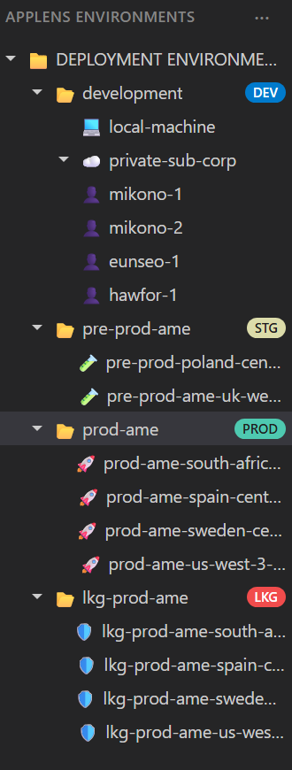
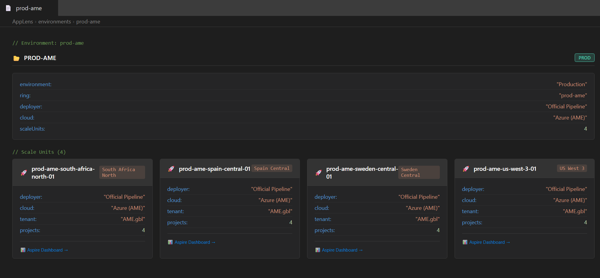
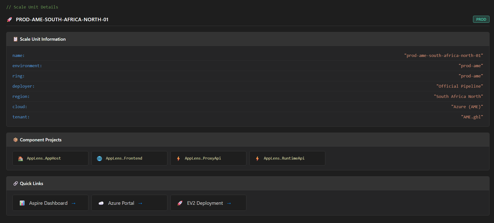

# AppLens Infrastructure Mock

A VS Code-styled visualization of the AppLens deployment infrastructure, showing environments, scale units, and the Last Known Good (LKG) failback architecture.

## 🌐 Live Demo

[](https://praveentb.github.io/applens-infra-mock/)


## 🗂️ Deployment Environments Structure

```
📁 DEPLOYMENT ENVIRONMENTS
│
├── 📂 development ································· [DEV]
│   ├── 💻 local-machine
│   └── ☁️ private-sub-corp
│       ├── 👤 mikono-1
│       ├── 👤 mikono-2
│       ├── 👤 eunseo-1
│       └── 👤 hawfor-1
│
├── 📂 pre-prod-ame ································ [STG]
│   ├── 🧪 pre-prod-poland-central-01
│   └── 🧪 pre-prod-ame-uk-west-01
│
├── 📂 prod-ame ···································· [PROD]
│   ├── 🚀 prod-ame-south-africa-north-01
│   ├── 🚀 prod-ame-spain-central-01
│   ├── 🚀 prod-ame-sweden-central-01
│   └── 🚀 prod-ame-us-west-3-01
│
└── 📂 lkg-prod-ame ································ [LKG]
    ├── 🛡️ lkg-prod-ame-south-africa-north-02
    ├── 🛡️ lkg-prod-ame-spain-central-02
    ├── 🛡️ lkg-prod-ame-sweden-central-02
    └── 🛡️ lkg-prod-ame-us-west-3-02
```

## 🏗️ Environment Architecture

The AppLens infrastructure is organized in a hierarchical ring-based deployment model:

```
┌──────────────────────────────────────────────────────────────────────────┐
│                        DEPLOYMENT ENVIRONMENTS                           │
├──────────────────────────────────────────────────────────────────────────┤
│                                                                          │
│  ┌────────────────────────────────────────────────────────────────────┐  │
│  │                       DEVELOPMENT (DEV)                            │  │
│  │  ┌───────────────┐    ┌─────────────────────────────────────────┐  │  │
│  │  │ local-machine │    │           private-sub-corp              │  │  │
│  │  │  (localhost)  │    │  ┌─────────┐ ┌─────────┐ ┌──────────┐   │  │  │
│  │  │               │    │  │mikono-1 │ │mikono-2 │ │ eunseo-1 │   │  │  │
│  │  │ Manual Deploy │    │  │ eastus  │ │ westus2 │ │westeurope│   │  │  │
│  │  └───────────────┘    │  └─────────┘ └─────────┘ └──────────┘   │  │  │
│  │                       │  ┌─────────┐                            │  │  │
│  │                       │  │hawfor-1 │  Azure (Corp Subscription) │  │  │
│  │                       │  │northeur │                            │  │  │
│  │                       │  └─────────┘                            │  │  │
│  │                       └─────────────────────────────────────────┘  │  │
│  └────────────────────────────────────────────────────────────────────┘  │
│                                    │                                     │
│                                    ▼                                     │
│  ┌────────────────────────────────────────────────────────────────────┐  │
│  │                     PRE-PRODUCTION (STG)                           │  │
│  │                       pre-prod-ame                                 │  │
│  │   ┌────────────────────────┐    ┌────────────────────────┐         │  │
│  │   │ pre-prod-poland-central│    │ pre-prod-ame-uk-west   │         │  │
│  │   │     Poland Central     │    │       UK West          │         │  │
│  │   └────────────────────────┘    └────────────────────────┘         │  │
│  │                    Azure (AME) - Official Pipeline                 │  │
│  └────────────────────────────────────────────────────────────────────┘  │
│                                    │                                     │
│                                    ▼                                     │
│  ┌────────────────────────────────────────────────────────────────────┐  │
│  │                      PRODUCTION (PROD)                             │  │
│  │                         prod-ame                                   │  │
│  │  ┌───────────────┐ ┌───────────────┐ ┌───────────────┐             │  │
│  │  │ South Africa  │ │ Spain Central │ │Sweden Central │             │  │
│  │  │    North      │ │               │ │               │             │  │
│  │  └───────────────┘ └───────────────┘ └───────────────┘             │  │
│  │  ┌───────────────┐                                                 │  │
│  │  │   US West 3   │         Azure (AME) - Official Pipeline         │  │
│  │  └───────────────┘                                                 │  │
│  └────────────────────────────────────────────────────────────────────┘  │
│                                    │                                     │
│                         (Failback) │                                     │
│                                    ▼                                     │
│  ┌────────────────────────────────────────────────────────────────────┐  │
│  │                   LAST KNOWN GOOD (LKG)                            │  │
│  │                      lkg-prod-ame                                  │  │
│  │  ┌───────────────┐ ┌───────────────┐ ┌───────────────┐             │  │
│  │  │ South Africa  │ │ Spain Central │ │Sweden Central │             │  │
│  │  │  North (-02)  │ │    (-02)      │ │    (-02)      │             │  │
│  │  └───────────────┘ └───────────────┘ └───────────────┘             │  │
│  │  ┌───────────────┐                                                 │  │
│  │  │ US West 3-02  │         Azure (AME) - Official Pipeline         │  │
│  │  └───────────────┘                                                 │  │
│  └────────────────────────────────────────────────────────────────────┘  │
│                                                                          │
└──────────────────────────────────────────────────────────────────────────┘
```

## 🔄 Last Known Good (LKG) Build Concept

The LKG (Last Known Good) is a critical failback mechanism designed to minimize downtime during production incidents.

### How LKG Works

```
                           NORMAL OPERATION
                           ════════════════
                    
     ┌────────────┐         ┌─────────────┐
     │   Users    │ ──────► │  prod-ame   │  ◄── Live Traffic
     └────────────┘         │  (Current)  │
                            └─────────────┘
                                   │
                                   │  Deployment Pipeline
                                   │  keeps LKG one version behind
                                   ▼
                            ┌─────────────┐
                            │ lkg-prod-ame│  ◄── Standby (Last Stable Build)
                            │   (LKG)     │
                            └─────────────┘


                         INCIDENT / REGRESSION
                         ═════════════════════

     ┌────────────┐         ┌─────────────┐
     │   Users    │ ──╳──►  │  prod-ame   │  ◄── Broken/Regression
     └────────────┘         │   (Bad)     │
            │               └─────────────┘
            │
            │  Traffic Redirect (Failback)
            │
            ▼               ┌─────────────┐
            ────────────►   │ lkg-prod-ame│  ◄── Receives Traffic
                            │   (LKG)     │
                            └─────────────┘
```

### Key LKG Characteristics

| Aspect | Description |
|--------|-------------|
| **Purpose** | Quick production mitigation when a new deployment introduces regression |
| **Content** | Contains the last stable (verified) deployment |
| **Deployment** | Always one version behind `prod-ame` |
| **Activation** | Traffic redirected to LKG during incidents |
| **Benefit** | Minimizes Mean Time To Recovery (MTTR) |
| **Scale Units** | Mirrors production regions with `-02` suffix |

### Failback Flow Diagram

```
 ┌─────────────┐      ┌─────────────┐      ┌─────────────┐
 │   Traffic   │ ───► │  prod-ame   │ ─X─► │   (Broken)  │
 │  (Request)  │      │   Router    │      │   Service   │
 └─────────────┘      └──────┬──────┘      └─────────────┘
                             │
                             │ Automatic Failback
                             ▼
                      ┌─────────────┐      ┌─────────────┐
                      │ lkg-prod-ame│ ───► │   (Stable)  │
                      │   Router    │      │   Service   │
                      └─────────────┘      └─────────────┘
```

## 🌍 Environment Types

### 1. Development (`DEV`)
- **local-machine**: Localhost development with Aspire Dashboard
- **private-sub-corp**: Personal Azure instances in corporate subscription
- **Deployer**: Developer (Manual)
- **Purpose**: Development, testing, and experimentation

### 2. Pre-Production (`STG`)
- **pre-prod-ame**: Staging environment for validation
- **Deployer**: Official Pipeline
- **Cloud**: Azure (AME)
- **Purpose**: Pre-production validation before production rollout

### 3. Production (`PROD`)
- **prod-ame**: Live production environment
- **Deployer**: Official Pipeline
- **Cloud**: Azure (AME)
- **Purpose**: Serves live customer traffic

### 4. Last Known Good (`LKG`)
- **lkg-prod-ame**: Failback production environment
- **Deployer**: Official Pipeline
- **Cloud**: Azure (AME)
- **Purpose**: Instant failback during incidents

## 📦 Component Projects

Each scale unit runs the following components:

| Project | Icon | Description |
|---------|------|-------------|
| `AppLens.AppHost` | 🏠 | .NET Aspire orchestration host |
| `AppLens.Frontend` | 🌐 | User-facing web application |
| `AppLens.ProxyApi` | ⚡ | API proxy layer |
| `AppLens.RuntimeApi` | ⚡ | Runtime API services |
| `AppLens.IntegrationTests` | 🧪 | Integration test suite (dev only) |

## 🔗 Scale Unit Quick Links

Each scale unit provides access to:
- **Aspire Dashboard** - Distributed tracing and telemetry
- **Azure Portal** - Resource management (cloud deployments)
- **EV2 Deployment** - Deployment management (AME environments)

## 🚀 Getting Started

1. Open `index.html` in a web browser
2. Navigate the environment tree in the left sidebar
3. Click on any environment or scale unit to view details
4. Use quick links to access dashboards and portals

## 📊 Environment Summary

| Ring | Type | Scale Units | Cloud | Deployer |
|------|------|-------------|-------|----------|
| development | DEV | 5 | Local/Azure Corp | Manual |
| pre-prod-ame | STG | 2 | Azure (AME) | Pipeline |
| prod-ame | PROD | 4 | Azure (AME) | Pipeline |
| lkg-prod-ame | LKG | 4 | Azure (AME) | Pipeline |

---

## 📸 Screenshots

### Environments Structure

The sidebar displays the hierarchical structure of all deployment environments, organized by rings (DEV, STG, PROD, LKG). Each environment contains scale units that can be expanded to view individual deployments.



### Production Environment Overview

When selecting a production environment, you can see all the scale units deployed across different regions, along with environment metadata and quick access links.



### Scale Unit Details & Quick Links

Clicking on a specific scale unit reveals detailed information including region, cloud provider, tenant, component projects, and quick links to Aspire Dashboard, Azure Portal, and EV2 Deployment.


